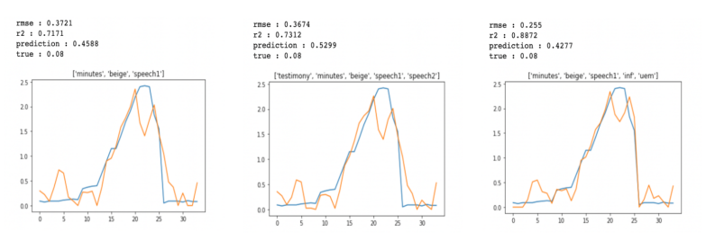
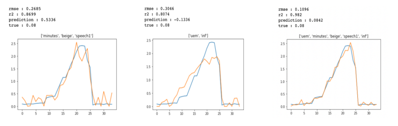
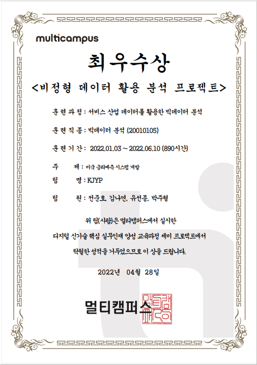

# 미국 연방준비제도 텍스트 데이터를 활용한 금리 예측 

> 2022/04/08 ~2022/04/22
>
> `최우수팀 선정`

- 해당 프로젝트는 '멀티캠퍼스 서비스 산업 데이터를 활용한 빅데이터 분석' __비정형 데이터 활용 분석 프로젝트__ 결과물입니다.
- 텍스트 데이터 출처: [Federal Reserve Board](https://www.federalreserve.gov/)

## Abstract

 This project was started from the curiousity that if future interest could be predicted using text data. First, we scraped text data such as beigebook and speech from Fed website. Second, we converted text data into numberical data to compare them with __interest rates history__. We tried several ways to do that. The length of each text data is quite long, so there is difficulty to extract only the necessary parts. Thus, we used `question-answering` and `sentiment analysis` from pipelines. Finally, we were able to find that such texts talking about the economy of the time could help expalin the movement of the U.S. interest rates.

## Preprocessed: Pipelines

`from transformers import pipeline`

- __question-answering__: The lines were extracted from the texts through questions that could confirm the economic situation at the time.
- __sentiment analysis__:  The collected lines were checked whetere they  were positive or negative, and the degrees of sentiment was used for the following analysis.

## EDA: Averaging

1. Combine collected data into a single data frame. (__Quarterly distribution__)

2. Divide the periods and calculate __average values__ for each period.

3. Confirm that the graph for the average values is similar to the graph for interest rates.

   

## Analysis: Regression Model

__degree = 1__

- Left: `minutes`, `beigebook`, `speech1`
- Center: `testimony`, `minutes`, `beigebook`, `speech1`, `speech2`
- Right: `minutes`, `beigebook`, `speech1`, `prices`,  `unemployment rate`

__degree = 2__

- Left: `minutes`, `beigebook`, `speech1`
- Center: `prices`,  `unemployment rate`
- Right: mixed

## Conclusion

 We verified there is possibility that text data alone can predict interest rates. With unemployment rate and prices, more sophisticated results could be predicted. Therefore, it is expected that it will be possible to predict more diverse economic indicators in the same way. Next, it will be possible to create a website or an application that provides future encomic forecasts. Furthermore, text data can be obtained from various sources to identify the characteristics by each sources. Then, it will be possible to analyze how they interact with certain economic indicators.

## Appendix

